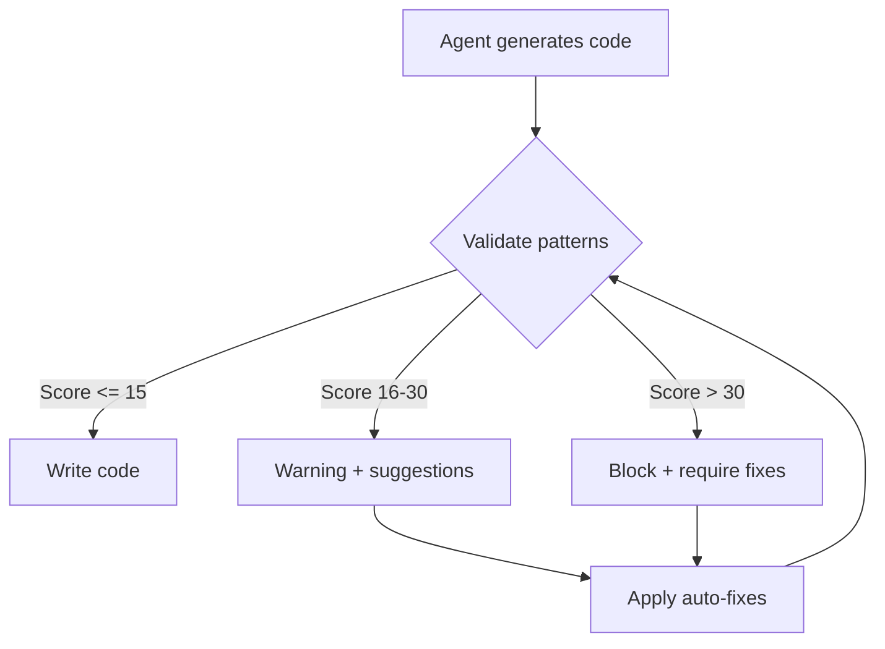

# Cognitive Load Validation System

## Purpose

This validation system integrates with Agent OS to ensure all generated code maintains low cognitive complexity and follows proven patterns from industry best practices.

## System Components

### 1. Pattern Registry
Location: `.agent-os/standards/cognitive-load/`
- `foundational-patterns.md` - Core patterns from proven sources
- `validation-rules.yml` - Configuration for validation
- `pattern-library/` - Language-specific patterns

### 2. Validation Engine
Validates code against registered patterns before writing to files.

### 3. Education Module
Provides contextual learning when violations are detected.

## Integration with Agents

### For Go Backend Agent (`go-backend.md`)

Add to agent instructions:
```markdown
## Cognitive Load Validation

Before writing any code:
1. CHECK against patterns in .agent-os/standards/cognitive-load/foundational-patterns.md
2. CALCULATE cognitive load score
3. BLOCK if score > 30
4. APPLY auto-fixes for known patterns
5. WRAP all errors with context
6. PREALLOCATE slices when size is known
7. EXTRACT defer statements from loops
```

### For SvelteKit Specialist (`sveltekit-specialist.md`)

Add to agent instructions:
```markdown
## Reactivity Safety

Before writing Svelte components:
1. CHECK for reactive loops in .agent-os/standards/cognitive-load/foundational-patterns.md
2. BREAK store references with spread operator
3. ADD initialization guards for onMount
4. AVOID bind: with store values
5. USE load functions for data fetching
```

## Validation Workflow



## Pattern Detection Rules

### Go Patterns

| Pattern ID | Detection Method | Auto-fix Available |
|------------|-----------------|-------------------|
| GO-ERROR-CONTEXT | Regex: `return err\s*}` | Yes - Wrap with fmt.Errorf |
| GO-DEFER-LOOP | AST: defer in for/range | Yes - Extract to function |
| GO-SLICE-PREALLOC | Regex: `var.*\[\].*append` | Yes - Add make() |
| GO-MAP-CONCURRENT | Context: goroutine + map | Partial - Add mutex |
| GO-NIL-CHECK | Regex: `if.*==\s*nil` | Yes - Use len() |
| GOFAST-SIMPLE-DI | AST: DI container patterns | Yes - Constructor injection |
| GOFAST-STRATEGY-PATTERN | Complexity: >3 abstraction layers | Yes - Simplify to interface |
| GOFAST-ERROR-VALUES | Regex: `panic\(|recover\(` | Yes - Return error |
| GOFAST-MINIMAL-DEPS | Import: external for stdlib task | Yes - Use stdlib |
| GOFAST-EXPLICIT-CONFIG | Regex: hardcoded values | Yes - Use config struct |

### Svelte Patterns

| Pattern ID | Detection Method | Auto-fix Available |
|------------|-----------------|-------------------|
| SVELTE-STORE-LOOP | AST: direct assignment | Yes - Add spread |
| SVELTE-INIT-GUARD | Context: onMount usage | Yes - Add flag |
| SVELTEKIT-SERVER-CLIENT | File: +page.server.ts | No - Requires refactor |
| SVELTEKIT-WATERFALL | Context: onMount fetch | Yes - Move to load |

## Scoring Algorithm

```typescript
function calculateCognitiveLoad(code: string, framework: string): number {
  let totalLoad = 0;
  
  // Check each pattern
  for (const pattern of getPatterns(framework)) {
    if (pattern.detect(code)) {
      totalLoad += pattern.cognitiveLoad;
    }
  }
  
  // Additional factors
  const nestingDepth = calculateNestingDepth(code);
  totalLoad += Math.pow(2, nestingDepth - 2); // Exponential for deep nesting
  
  const magicNumbers = countMagicNumbers(code);
  totalLoad += magicNumbers * 2;
  
  return Math.min(totalLoad, 100);
}
```

## Auto-fix Examples

### Go Error Context
```go
// Before
if err != nil {
    return err
}

// After (auto-fixed)
if err != nil {
    return fmt.Errorf("functionName: operation failed: %w", err)
}
```

### Svelte Store Reference
```svelte
// Before
onMount(() => {
    data = store.value;
});

// After (auto-fixed)
onMount(() => {
    data = { ...store.value };
});
```

## Education Messages

When a pattern violation is detected, provide educational context:

```
PATTERN VIOLATION: GO-DEFER-LOOP
Cognitive Load: 7/10

PROBLEM: Using defer inside a loop causes all defers to accumulate until
the function returns, not the loop iteration. This can cause resource 
exhaustion with file handles or connections.

SOLUTION: Extract the loop body to a separate function where defer will
run after each iteration.

EXAMPLE:
[Show bad vs good example from foundational-patterns.md]
```

## Metrics and Tracking

Track the following metrics:
- Most common violations per agent
- Average cognitive load score per file
- Auto-fix success rate
- Time saved through validation

## Progressive Enhancement

As agents learn:
1. Start with strict enforcement (block on violations)
2. Move to warnings as patterns are internalized
3. Eventually run in audit-only mode
4. Collect new patterns from corrections

## Configuration

Create `.agent-os/standards/cognitive-load/config.yml`:

```yaml
validation:
  enabled: true
  mode: strict  # strict | warning | audit
  
thresholds:
  block: 30
  warn: 15
  
frameworks:
  go:
    patterns: [GO-ERROR-CONTEXT, GO-DEFER-LOOP, GO-SLICE-PREALLOC]
    autofix: true
    
  svelte:
    patterns: [SVELTE-STORE-LOOP, SVELTE-INIT-GUARD]
    autofix: true
    
reporting:
  log_violations: true
  track_metrics: true
```
